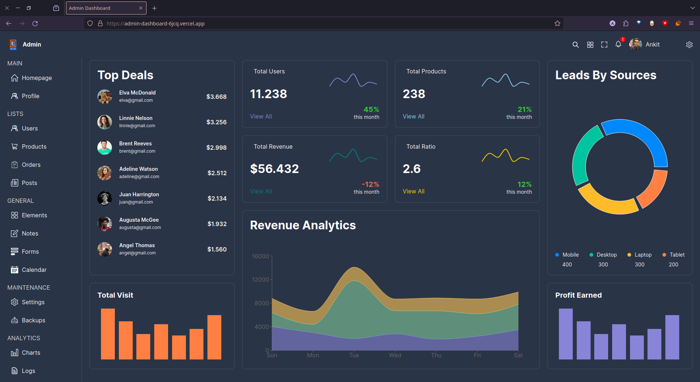

# Admin Dashboard Project

This project is an admin dashboard application built using React.js. It provides a user-friendly interface for managing various aspects of an admin panel.

## Live Demo

You can view the live demo of this admin dashboard project [here](https://admin-dashboard-6jcq.vercel.app/).

## Screen shot



## Features
-CRUD operation for admin

## Technologies Used

- React.js
- HTML5 & CSS3
- JavaScript (ES6+)
- React Router for routing
- React-query
- Vercel for deployment

## Installation

To run this project locally, follow these steps:

1. Clone the repository:

   ```bash
   git clone https://github.com/your-username/admin-dashboard.git
2. Navigate to the project directory:
   ```bash
   cd admin-dashboard
3. Install dependencies:
   ```bash
   npm install

4. Run the project
   ```bash
   npm run dev


